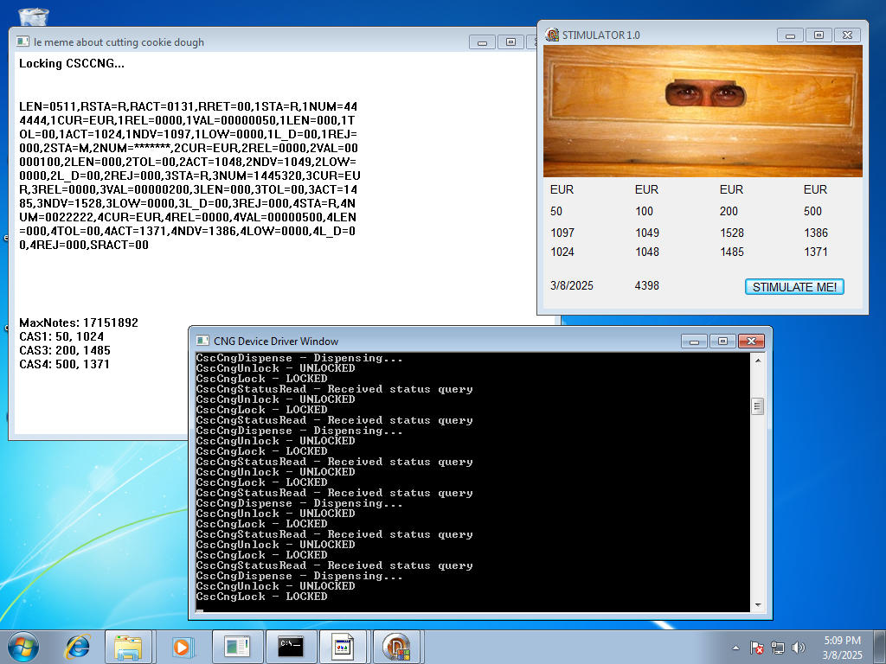

# Fake-CSCWCNG
NOTE: The DLL console window has been removed. All events are now logged to a log file located in the the C drive called CNG.log.

A DLL that emulates the CSCWCNG DLL from Wincor Nixdorf Procash NDC-DDC. Useful for ATM malware testing.

Based off Archi73ct's CSCWCNG-fake-dll. (https://github.com/Archi73ct/CSCWCNG-fake-dll)

